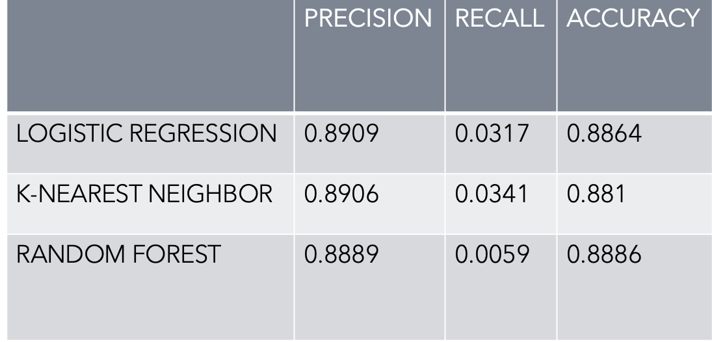

# Readmission-Prediction
Predicting Patient Readmission in the Hospital using Python.

<h2>Introduction:</h2>
<ul><li>Patient frailty or the progression of chronic disease are the leading causes of hospital readmissions.</li>
<li>However, if this is not the case and the high readmission rate is due to patients with specific medical conditions, such as diabetes or asthma, it could indicate a problem with quality of care.</li>
<li>In this approach, we try to predict which attribute is the cause of a patient's readmission within 30 days of discharge.</li></ul>

<h2>Dataset:</h2>
<ul><li>The data represents clinical care at 130 hospitals in the US and integrated delivery networks over a ten-year period (1999-2008). It has more than 50 characteristics that represent patient and hospital results.[1]</li>
<li>The data depicts the outcomes of diabetic patients as well as those who were readmitted. The outcome of readmission is one of three options: within 30 days, after 30 days, or not readmitted.</li>
<li>The data-points are extracted based on certain criterions such as: 
<ol><li>It is an inpatient admission. </li>
<li>It is a diabetic encounter. </li>
<li>The stay had to be at least 1 day and no more than 14 days. </li>
<li>Laboratory tests were carried out. </li>
Medications were monitored.[1]</li></ol> </li></ul>

<h2>Cleaning:</h2>

As real-world data contains incomplete, redundant, and noisy information, a number of sanitizing processes are used, which include: 

<ul><li>Initially, there were no null values in the dataset, but there were some "?" As a result, we've replaced it with "NULL" for ease of use. </li>
<li>Changing the Null values to the most common value or the most frequent value(MODE).</li>
<li>Weight and payer code are being removed because they have the most "NULL" values. </li>
<li>As we're concerned about patients being readmitted within 30 days of discharge, we've modified the entire column to "YES" if they're readmitted within 30 days, otherwise "NO". </li></ul>

<h2>Pre-Processing:</h2>
<ul><li>To increase the model accuracy, the independent and dependent features should be as linearly aligned as possible, thus data preprocessing is an essential step in the creation of every Machine Learning model. </li>
<li>By Data Preprocessing we mean scaling the data, changing the categorical values to numerical ones, normalizing the data, etc.</li>
<li>It is the goal of a data preprocessing technique to convert categorical column data to numerical data (from string to numeric). </li>
<li>Manual Encoding is used to achieve this (a provision to encode them in a machine-understandable format). </li>
<li>Variables measured at different scales do not make a significant contribution to the model fitting, which might influence the results. Therefore, feature-wise normalization, such as Min-Max Scaling, is used. </li>
<li>After min-max scaling, the feature values are within the range [0,1]. </li></ul>

<h2>Feature Selection:</h2>

[2]Out of 51 FEATURES some of them are removed based on the following:

<ul><li>maximum number of null values 
(example: weight, payer_code, examide, citoglipton, glimepiride-pioglitazone)</li>
<li>less correlated with readmitted 
(example: diag_1,diag_2, diag_3)</li>
<li>Irrelevant to the class 
(example: Unnamed: 0, patient_nbr, encounter_id )</li></ul>

<h2>Model Results:</h2>

<h2>Under Sampling:</h2>
<ul><li>To balance the class distribution 
<li>A class distribution that is unbalanced will have one or more classes with few examples (minority classes) and one or more classes with many examples (majority classes).</li>
<li>It's set in the context of a binary (two-class) classification problem, with class 0 representing the majority and class 1 representing the minority. </li>
<li>In order to better balance the class distribution, under-sampling techniques remove examples from the training dataset that belong to the majority class. </li></ul>

<h2>Modeling:</h2>
<ul><li><b>LOGISTIC REGRESSION:</b> 
It is a supervised learning classification algorithm used to predict the probability of a target variable(in this case its binary (Y/N)). The nature of target or dependent variable is dichotomous.</li>
<li><b>RANDOM FOREST:</b> 
It generates decision tree for each sample and selects the best by voting every predicted result. </li>
<li><b>K-NEAREST NEIGHBOR:</b> 
It is a supervised learning algorithm where new data can be added seamlessly because it trains just before making predictions.</li></ul>

<h2>Evaluation Techniques:</h2>
<ul><li><b>Confusion matrix:</b> it is used to measure the performance of the classification problem.</li>
<li><b>Accuracy:</b> it is the ratio of number of correct predictions to the total number of predictions.</li>
<li><b>Recall:</b> (sensitivity) proportion of actual positives</li>
<li><b>Precision:</b> proportion of positive identifications (positive-predictive value)</li>
<li><b>ROC-AUC Score:</b> it is calculated based on varying threshold values. It’s a probability curve that shows the capability of model in distinguishing the classes.</li></ul>

<h2>Results:</h2>

<h2>Conclusion:</h2>

To summarize, 

<ul><li>We are using 3 models to predict the patient readmission within 30 days of discharge.</li>
<li>A1cresult is a useful predictor for patients with diabetes mellitus, and it can be used to lower readmission rates and costs associated with diabetes care.[2]</li>
<li>Random Forest comparatively yields the best results.</li></ul>

<h2>References:</h2>
[1] Dataset: https://archive-beta.ics.uci.edu/ml/datasets/diabetes+130+us+hospitals+for+years+1999+2008  
[2] Beata Strack, Jonathan P. DeShazo, Chris Gennings, Juan L. Olmo, Sebastian Ventura, Krzysztof J. Cios, and John N. Clore ,"Impact of HbA1c Measurement on Hospital Readmission Rates: Analysis of 70,000 Clinical Database Patient Records", https://downloads.hindawi.com/journals/bmri/2014/781670.pdf
